# 🏥 Hospital Multi-Agent System Architecture

## High-Level System Architecture

```mermaid
graph TB
    subgraph "Frontend Layer"
        UI[🎨 Streamlit UI]
        API[🌐 REST API]
        MOBILE[📱 Mobile App]
    end
    
    subgraph "API Gateway Layer"
        GATEWAY[⚡ AWS API Gateway]
        AUTH[🔐 Authentication]
        RATE[📊 Rate Limiting]
    end
    
    subgraph "Agent Orchestration Layer"
        SUPERVISOR[🤖 Supervisor Agent<br/>Route & Coordinate]
        MEMORY[🧠 Memory Manager<br/>Session & Long-term]
    end
    
    subgraph "Specialized Agents"
        TRIAGE[🩺 Triage Agent<br/>Symptom Analysis]
        BOOKING[📅 Booking Agent<br/>Appointments]
        REMINDER[⏰ Reminder Agent<br/>Notifications]
        PHARMACY[💊 Pharmacy Agent<br/>Prescriptions]
    end
    
    subgraph "Tool Functions (Lambda)"
        TOOLS1[🔍 Search Symptoms]
        TOOLS2[📋 Patient History]
        TOOLS3[📅 Check Availability]
        TOOLS4[📧 Send Notifications]
        TOOLS5[💊 Prescription Tools]
    end
    
    subgraph "Data Layer"
        PATIENTS[(👥 Patients Table<br/>DynamoDB)]
        APPOINTMENTS[(📅 Appointments<br/>DynamoDB)]
        MEMORY_DB[(🧠 Memory Store<br/>DynamoDB)]
        PRESCRIPTIONS[(💊 Prescriptions<br/>DynamoDB)]
    end
    
    subgraph "External Services"
        BEDROCK[🤖 AWS Bedrock<br/>Claude 3.5 Sonnet]
        SNS[📱 AWS SNS<br/>Notifications]
        SES[📧 AWS SES<br/>Email]
    end
    
    %% Connections
    UI --> GATEWAY
    API --> GATEWAY
    MOBILE --> GATEWAY
    
    GATEWAY --> AUTH
    GATEWAY --> RATE
    GATEWAY --> SUPERVISOR
    
    SUPERVISOR --> MEMORY
    SUPERVISOR --> TRIAGE
    SUPERVISOR --> BOOKING
    SUPERVISOR --> REMINDER
    SUPERVISOR --> PHARMACY
    
    TRIAGE --> TOOLS1
    TRIAGE --> TOOLS2
    BOOKING --> TOOLS3
    REMINDER --> TOOLS4
    PHARMACY --> TOOLS5
    
    TOOLS1 --> PATIENTS
    TOOLS2 --> PATIENTS
    TOOLS2 --> MEMORY_DB
    TOOLS3 --> APPOINTMENTS
    TOOLS4 --> SNS
    TOOLS4 --> SES
    TOOLS5 --> PRESCRIPTIONS
    
    SUPERVISOR --> BEDROCK
    TRIAGE --> BEDROCK
    BOOKING --> BEDROCK
    REMINDER --> BEDROCK
    PHARMACY --> BEDROCK
    
    MEMORY --> MEMORY_DB
    
    classDef frontend fill:#e1f5fe
    classDef agents fill:#f3e5f5
    classDef tools fill:#fff3e0
    classDef data fill:#e8f5e8
    classDef external fill:#fce4ec
    
    class UI,API,MOBILE frontend
    class SUPERVISOR,TRIAGE,BOOKING,REMINDER,PHARMACY agents
    class TOOLS1,TOOLS2,TOOLS3,TOOLS4,TOOLS5 tools
    class PATIENTS,APPOINTMENTS,MEMORY_DB,PRESCRIPTIONS data
    class BEDROCK,SNS,SES external
```

## Agent Communication Flow

## Data Flow Architecture

## AWS Services Integration

## Security Architecture

## Deployment Architecture

## Cost Optimization Architecture

## Next Steps for Architecture Enhancement

1. **Add Real-time Features**: WebSocket support for live chat
2. **Implement Caching**: Redis for frequently accessed patient data
3. **Add Analytics**: Real-time dashboards for hospital operations
4. **Enhance Security**: Advanced threat detection and response
5. **Scale Globally**: Multi-region deployment for disaster recovery
6. **Add ML Pipeline**: Custom models for specialized medical tasks
